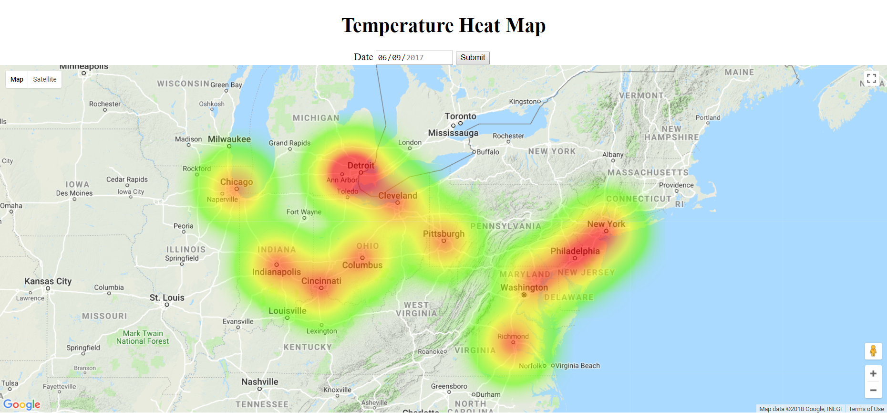

# Heat_Map
This project is a data visualization web app that shows a heat map of temperature in major cities in PJM. Users can access temperature heat map of different days of a year by using the date selector at the top of the map.

## Get Started
After cloning or downloading the folder, double-click **heatmap.html** to load the web page. Use the date picker to select the day and click **Submit** to load the new heatmap. The heatmap includes temperature data of major cities in PJM, including Ann Arbor, Baltimore, Chicago, Cincinnati, Cleveland, Columbus, Detroit, Indianapolis, New York, Philadelphia, Pittsburgh, and Richmond  
A screenshot of the web app is shown below:

## Built with
The project is built with:
* HTML
* Javascript
* [Google Maps JavaScript API](https://developers.google.com/maps/documentation/javascript/)
* Python -- for processing weather data

## Temperature Data
The temperature data the project used are acquired from the **Data Tools: 1981-2010 Normals** in [NOAA's website](https://www.ncdc.noaa.gov/cdo-web/datatools/normals)

